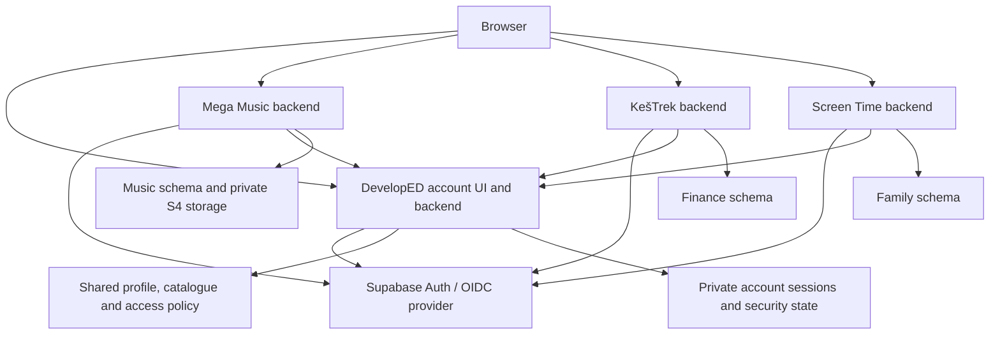

# DevelopED account and ecosystem architecture

Status: architecture with local implementation in progress; not deployed. Updated 2026-09-20.

Implementation notes and actual test results are tracked in
[ecosystem-identity-progress.md](ecosystem-identity-progress.md). The current
[API contract](ecosystem-identity-api.md) supersedes illustrative interfaces here.
The 2026-09-21 revision adds default portal-only browser logout and keeps global
interactive logout as a separate explicit security action. Neither logs out all
apps on only one device: there is no authorization-code/browser-family binding.
See the current API contract for the implemented scopes; older proposed scopes
below are not deployment evidence. Provider protocol
qualification passed with additional mandatory gateway-isolation requirements;
see [qualification results](ecosystem-provider-qualification.md).

This document turns the proposed DevelopED registration, account profile and app
picker into a delivery plan. It is grounded in the current DevelopED, Mega Music,
KešTrek, Screen Time and shared Supabase implementation. Findings and their limits
are recorded in [ecosystem-identity-evidence.md](ecosystem-identity-evidence.md).

User clarification: preserving existing interactive sessions is unnecessary;
the owner is the current user. Plan a coordinated cutover and sign in again.
Preserve identity UUIDs, product data, administrator assignments, storage keys,
subscriptions and device credentials. This is not permission to reset the shared
database or change unrelated applications.

Confirmed v1 decisions from 2026-09-20 are in section 17. Central bug reporting
with automatic app assignment is specified in section 18. Those decisions
supersede earlier suggestions about expiring accounts or self-service deletion;
account lifetime and security-token/session expiry are separate policies.

## 1. Product contract

One person has one DevelopED account. Registration and confirmation unlock the
eligible free offerings that the operator has published. Each product retains
its own data, permissions, settings and paid features.

| Requirement | Planned behaviour |
| --- | --- |
| Central registration | Register through DevelopED; an app's Register link starts the same flow with an app return destination. |
| Email confirmation | No normal app access until the address is verified. Verification does not create privileged roles. |
| Central login | Email/password initially; the implementation accommodates MFA and later passkeys. |
| Default signed-in page | The DevelopED app picker. An explicit login initiated by a product returns to that product instead. |
| App tiles | Icon, name, short description and relevant plan/access state. Only operator-published offerings appear. |
| Avatar menu | My profile, Account security, Log out. Administrative navigation appears only for platform administrators. |
| Central profile | Name, avatar, language, email and password management. Email changes remain pending until verified. |
| App launch | Opening a tile establishes an app session without asking for credentials again when the central session is valid. |
| Direct product login | Visiting a product directly can start login and return to the same product/deep link, without visiting the picker. |
| DevelopED footer | A consistent, accessible DevelopED logo link returns to the central entry point. |
| Independent domains | KešTrek uses the same authentication contract as developed.sk subdomains. |
| Future applications | Register an app, integrate the common authentication/access contract, choose its availability and publish it. |
| Registration controls | Superadmin selects open, invitation-only or closed; existing users retain login and recovery. |
| Account lifetime | Accounts do not expire automatically, including because of inactivity. Identity/data deletion is manual in v1. |
| Account administration | Platform superadmin can lock/unlock accounts, set a password and initiate password reset through audited central actions. |
| Support | Customer communication through info@developed.sk; Report a bug in every app opens the central form with the product already assigned. |

Recommended interpretation of direct login: the product starts a top-level
redirect to a DevelopED email/password page labelled with the product name.
Credentials are entered on DevelopED, then the user returns immediately. This
preserves direct entry and familiar email/password authentication.

If the requirement means credentials must be typed inside each product's own
origin, that is a different product choice. It distributes credential handling,
complicates MFA and central-cookie establishment, and reduces isolation between
apps. Do not silently substitute an embedded form or implement a custom login
token handoff. Keep that variant out of the recommended first implementation;
confirm it only if same-origin password forms are actually required.

## 2. Decisions and scope

| Decision | Recommendation | Reason |
| --- | --- | --- |
| Identity store | Keep existing Supabase Auth and user UUIDs. | Shared identities and foreign keys already exist. |
| Federation protocol | OpenID Connect, authorization code, PKCE S256. | Standard across domains and future native clients. |
| Provider | Qualify the installed Supabase OAuth server first. | Its running version contains the feature, but it is disabled and needs testing. |
| Web session model | App-specific backend sessions; browser receives an opaque HttpOnly cookie. | Consistent revocation and reduced browser token exposure. |
| Portal | Add a TypeScript account service and authenticated UI to developed-web. | Keep product logic outside the central portal. |
| Marketing website | Retain the existing static bilingual pages and assets. | No need to rebuild the public website to introduce accounts. |
| Infrastructure | Use the existing scoped VPS/reverse-proxy pattern for the account service, subject to origin-routing verification. | Direct database access stays private; no new public database port. |
| Data model | Extend the existing core registry/profile/access model and add a private account schema. | Avoid duplicate identity registries. |
| Provisioning | Eligibility on verification; product setup on first use. | Signup must not depend on every product being healthy. |
| Existing sessions | Invalidate during cutover. | Explicitly acceptable to the owner. |
| Existing data | Retain IDs and records; migrate profile ownership deliberately. | No account recreation or cloud-storage moves. |
| Billing | Represent entitlements now; defer checkout and billing integration. | Free access and paid access need a clear model before payment processing. |
| App registration | Operator-only; no dynamic public OAuth client registration. | This is a controlled first-party ecosystem. |
| Transactional email | Mailjet, From noreply@developed.sk. | Existing provider, confirmed by the owner. |
| Customer correspondence | Zoho, info@developed.sk. | Existing customer communication channel, confirmed by the owner. |
| User lifecycle | No automatic account expiry; manual identity/data deletion. | Low expected account volume; preserve a clear operator workflow. |
| Bug reports | Central form and admin queue; originating app assigned by each app's report link. | Users do not need to find or select the correct product. |

Use one central service and a database-backed worker initially. Do not introduce
an event-bus cluster, Kubernetes, an organisation service or a new microservice
per feature for this scope. A durable outbox in Postgres is sufficient for mail,
profile notifications and revocation delivery.

Supabase's public OAuth setup guide still describes the feature as beta. Passing
the provider qualification gate in section 14 is required before committing to
production use. If it fails, assess a mature provider such as Keycloak as a
separate architecture decision. Keycloak is not a drop-in replacement for
Supabase identity UUIDs, PostgREST tokens or password storage; that alternative
adds migration and integration work. Do not solve a failed gate by inventing an
OAuth server. [Provider setup](https://supabase.com/docs/guides/auth/oauth-server/getting-started),
[Keycloak OIDC interfaces](https://www.keycloak.org/securing-apps/oidc-layers).

## 3. Components and trust boundaries



The arrows to the central backend are narrow policy/session APIs, not permission
to browse every user or product. Credentials for those APIs are bound to one
application. The authenticated caller's app identity comes from server-verified
credentials, never a request body's app_id.

Central account service owns registration, identity changes, recovery, the
canonical profile, published offerings and central session state. Supabase owns
password hashing, authentication factors, OAuth grants, signing and refresh
tokens. Each app owns its product permissions and records.

An app receives a verified identity and permission to operate within its scope.
It must not receive platform administrator credentials, the provider's private
signing key, or another app's tokens. Selecting a Supabase schema in a client
does not narrow a service-role key's actual permissions.

Today some product services hold the shared service-role key. Consequently,
their compromise can reach beyond their product. This is a current trust-boundary
limitation, not something central login fixes automatically. Remove broad keys
from normal user-facing product paths as part of preparing for public signup.
Use user-scoped RLS requests or an application-specific database role; narrowly
privileged system operations remain server-only.

Inventory other consumers of this same identity service, including unpublished
apps, before claiming server-level isolation. Any remaining service with a
shared admin key still has platform-wide power, even if its tile is hidden. The
first-party API/client-isolation guarantees can be delivered for these three
apps independently; containment of a compromised backend additionally requires
restricting every holder of broad credentials or separating its infrastructure.
Do not expand a three-app implementation into edits of other products without
making that additional work explicit.

Also inventory every existing password/email/reset writer against the shared
identity, even in an app not selected for the picker. Central password changes
already affect those credentials. Conversely, a legacy app's admin-password
endpoint could bypass the new security workflow. Before claiming exclusive
central account management, those writers must delegate centrally or lose that
authority. Until then, describe the limitation explicitly rather than promising
ecosystem-wide security behaviour that only three consumers implement.

## 4. URLs, routing and website integration

Live routing currently redirects developed.sk to www.developed.sk. The default
proposal preserves www as canonical and treats both spellings as the DevelopED
entry point. Choosing the apex instead is possible, but should be a deliberate
SEO, redirect and cookie configuration change, not an incidental auth change.

| Canonical path | Responsibility |
| --- | --- |
| / and /en/ | Existing public homepage when signed out; temporary no-store redirect to /apps when centrally signed in. |
| /apps | Picker, with central authentication required. |
| /login and /register | Central entry and account creation. |
| /verify-email | Explicit confirmation screen; a GET must not consume an email credential. |
| /forgot-password and /reset-password | Central recovery. |
| /profile | Name, avatar, language and email/password actions. |
| /security | Sessions, MFA management and log out everywhere. |
| /account/authorize | Provider authorization UI/controller; validates the requesting application and eligibility. |
| /admin/apps and /admin/users | Operator catalogue and ecosystem access management. |
| /report-bug/:appSlug | Central bug form with a registered product already assigned; supports signed-out reporting. |
| /report-bug | General DevelopED portal report, automatically assigned to the portal. |
| /admin/reports | Superadmin report inbox, filterable by app, status, user and date. |
| /api/account/* | Same-origin browser API. |

Use /about or another explicit marketing route if signed-in visitors need to
open the public presentation without being redirected to their picker.

Keep the current provider issuer stable for the first release. Branding the
login page does not require changing the issuer URL. Moving it to
auth.developed.sk affects every consumer that validates issuer claims, including
apps outside this rollout. Treat that as a separately inventoried change.

The existing gateway returns 401 to an unauthenticated OIDC discovery request.
Standard client discovery cannot be assumed to work. Add only the necessary
public discovery/JWKS and OAuth protocol routing, leaving provider/client
authentication intact at protected endpoints. Never expose Studio, provider
administration or the whole repository through a broad proxy exception.

Use top-level redirects, not hidden cross-domain iframes or third-party-cookie
sharing. App callbacks use their own origin and exact registered paths. Do not
set Domain=.developed.sk cookies. Use __Host- cookies with Secure, HttpOnly,
Path=/ and an appropriate SameSite policy (Lax for the intended GET callback).

Authenticated HTML, account APIs, callbacks and cookie-dependent root redirects
must be private/no-store. A CDN must never reuse a logged-in redirect or profile
response for someone else. Verify the live proxy configuration: the repository's
vercel.json is not proof that those headers are applied to the current origin.
Change CSP narrowly for the actual account UI and callback flow.

## 5. Identity, profile and access model

The following is a logical design, not executable migration SQL. Extend existing
tables in place and preserve the current enum values for unrelated consumers.
Validate indexes, constraints, grants and trigger interactions during migration
design. New security/session tables belong in an unexposed private schema.

| Entity | Owner and proposed fields | Invariants |
| --- | --- | --- |
| auth.users | Provider-managed identity and verified email | Keep current UUIDs. Do not manually edit password hashes. |
| core.profiles | Existing display_name/photo_url; add preferred_locale and profile_version as needed | Profile editing cannot modify platform role. Email authority remains auth.users. |
| core.apps | Existing stable ID, name, icon, base_path and status; add ecosystem visibility/access policy or a side table | A stored launch URL is operator-controlled; status and listing visibility are separate. |
| core.app_access | Existing unique user/app membership; add status/provisioning metadata or a side table | Suspension is an explicit state, not deletion of membership. |
| App offering policy | App, join policy, free plan identifier, published time, policy version | Public free, invitation-only, paid-only and closed are distinct. |
| App entitlement | User/app, plan, source, validity and version | Server-owned; a plan is not an administrative role. Preserve grants and paid plans. |
| accounts.security_state | User, active/disabled/deletion state, security_version | Shared revocation authority, never user-editable. |
| accounts.login_sessions | Central session ID/hash, user, provider session, creation, auth time, idle/absolute expiry, revoked time | One browser login family; rotate identifiers after authentication/step-up. |
| accounts.app_sessions | App, user, provider session, central family, version and expiry/revocation | Created only after validated OIDC; an app can manage only its own records. |
| accounts.login_bindings | Short-lived correlation between provider authorization and central login family | No reusable login token; consume/expire after successful binding. |
| accounts.oauth_client_mapping | Product, environment, web/native client IDs and approved return configuration | Provider client secrets stay in secret storage, not the picker API. |
| accounts.operations / outbox | Operation ID, type, user, version, status, retry metadata | Idempotency, delivery retries and reconciliation; no plaintext passwords. |
| accounts.audit_events | Actor, subject, app, action, result, timestamp, safe correlation IDs | No raw tokens, passwords, verification URLs or sensitive request bodies. |
| accounts.registration_policy | Open/invitation-only/closed mode, version and operator audit | Signup mode is separate from each product's join policy. Closing signup does not disable login or support. |
| accounts.registration_invitations | Hashed invitation credential, intended recipient where applicable, expiry and redemption | Short-lived invitation does not imply expiring account; no automatic admin entitlement. |
| accounts.support_reports | Internal ID, public ticket reference, app ID, server timestamp, nullable authenticated reporter UUID, separately labelled contact email, description, safe diagnostics, status | Central/private data. App attribution is automatic; a typed email never establishes user identity. |
| accounts.support_report_events | Report ID, actor, status changes and internal notes | Superadmin-only notes; audit changes without emailing sensitive report contents. |

Keep database transactions short and do not hold row locks while calling the
provider, a product or an email service. Membership/entitlement changes and their
outbox event commit together; workers claim jobs in short transactions and use
leases so a crash does not strand work. Add unique constraints for idempotency
keys, indexes for session lookup/revocation by user and family, and indexes on
foreign keys used by cleanup. Process expiry/cleanup in bounded batches. Scope
grants and migration bookkeeping to these schemas on the shared instance.

For this small ecosystem, one service can own these related records. Do not
build two competing entitlement systems: existing app-specific quota/plan
details remain authoritative until explicitly migrated, with the portal showing
a projection. Central access status always determines whether an app may be used.

Effective access must satisfy every applicable condition:

```text
verified and active identity
AND application operationally enabled
AND registered client allowed for that application and environment
AND active central/app session (for interactive requests)
AND no explicit app suspension or deletion restriction
AND eligible membership / published free offering / valid invitation or plan
AND product-level permission on the requested resource
```

Explicit denial wins over free-tier eligibility. Removing or suspending access
must not be undone by an upsert on the next login. Platform role, app role,
subscription and household/workspace role are separate concepts. In particular,
music administrator does not imply ecosystem administrator; opening Screen Time
does not associate a user with an existing family.

The first portal release manages app availability/access, not every product's
role editor. Existing core.app_access.role is used by provisioning triggers;
existing product roles remain the authority for product actions until an
explicit role migration is designed. Never imply that changing a bootstrap role
in core automatically updates a previously provisioned product account.

The current catalogue has an authenticated SELECT-all policy. If an app is
confidential, hiding it in /apps is insufficient: constrain direct registry reads
as well, or expose a safe catalogue projection and remove access to private
fields/rows. Visibility still does not replace access enforcement.

Do not grant app access from user_metadata. OAuth identity scopes do not limit
Supabase database access: enforce ownership, client/resource scope and current
eligibility in APIs/RLS. Existing permissive policies combine with OR; adding
one restrictive-looking permissive policy does not secure the others. Use an
appropriate restrictive gate or amend every applicable policy, with tests for
direct PostgREST, views, RPCs and storage paths. [Supabase token security](https://supabase.com/docs/guides/auth/oauth-server/token-security).

## 6. Registration, verification and first use

The registration endpoint checks the current open/invitation-only/closed mode
server-side, including final admission so a concurrent closure cannot be bypassed.
Invitation-only signup consumes a valid scoped invitation idempotently. Closed
mode blocks new self-registration, not login, recovery, verification/resend for
already-created accounts or support. Existing verified identities can still
join eligible published apps; product eligibility is a separate control. A
superadmin may explicitly invite/create an account in closed mode; audit the
override. Do not implement the switch only by hiding the Register button.

1. Capture name, email, password and locale centrally. Record the applicable
   account terms version; marketing opt-in, if introduced, is separate.
2. Rate-limit by trusted client IP and normalised account identifier, using a
   shared store so limits survive process restarts and multiple replicas.
3. Create the unverified provider identity through the authorised central
   backend; global public Supabase signup remains disabled.
4. Create/update only central account state. Do not provision all products.
5. Deliver a branded verification email. Repeated requests have neutral public
   responses; they must not overwrite an existing person's password or name.
6. Verification is short-lived, purpose-bound, single-use and tied to the exact
   email/version. Require an explicit action so mail scanners do not consume it.
7. Once verified, require normal login, then return to /apps or the original
   validated application destination. Never retain the submitted password to
   auto-login later. Verification on another device must also work.

Email delivery and provider API writes are not a single database transaction.
Keep a recoverable pending registration and let the user resend mail if delivery
fails; do not casually delete a now-shared identity because an email job failed.
The outbox must never retain a password. If storing a verification credential
for delivery is unavoidable, encrypt it, restrict access and expire it promptly.

The owner has chosen non-expiring accounts. Do not automatically delete pending
registrations or inactive identities. Expired verification links can be replaced
with fresh ones; tokens, invitations, reservations and sessions still expire.
Manual removal of an unwanted pending account remains an operator action.

On first launch of an eligible free app, ensure membership idempotently using
the existing unique user/app constraint. The entitlement is Free unless an
existing stronger grant applies. Run that app's setup exactly once, with a
retryable failed/pending state. Concurrent tile clicks cannot duplicate folders,
quotas, storage prefixes or welcome messages.

KešTrek's existing AFTER INSERT trigger can be retained for its small initial
profile creation; make the central ensure-access operation respect existing
records and disabled states. Avoid extending these triggers to perform remote
network calls. A failed app setup should affect that launch, not registration
or the ability to use another product.

Publishing a new free app makes it eligible for existing verified accounts too.
No mass provisioning job is necessary. An app without a free tier requires an
explicit trial, invitation or purchase policy; it is not silently treated as free.

Entitlement changes also need lifecycle rules. On a paid-to-free downgrade, keep
existing data, apply the new limits and block additional consumption when over
quota; do not delete files or financial history automatically. Quotas must be
enforced by product APIs, including concurrent requests and background jobs.
For storage, reserve capacity atomically before issuing upload/import work and
release or reconcile reservations on completion/expiry. A Free badge alone is
not quota enforcement.

## 7. Login, app launch and account selection

```mermaid
sequenceDiagram
    participant B as Browser
    participant A as App backend
    participant I as OIDC provider
    participant C as DevelopED account service
    B->>A: Open app login / tile launch
    A->>A: Save state, nonce, PKCE verifier and safe local return path
    A->>I: Browser redirect with registered client + PKCE challenge
    I->>C: Browser redirect to authorization UI
    C->>C: Authenticate central cookie; check identity and app eligibility
    C->>I: Approve allowed authorization using central provider session
    I-->>C: Provider-generated redirect with code
    C->>C: Record short-lived login-family binding
    C-->>B: Redirect to exact app callback
    B->>A: Authorization code + state
    A->>I: Exchange code with PKCE and web client authentication
    I-->>A: Tokens and verified identity claims
    A->>C: Register app session and ensure app access
    C-->>A: Bound app session + current policy version
    A-->>B: Host-only cookie; redirect to original app route
```

Use maintained OIDC libraries. Validate issuer, signature, expiry, expected
audience, client identity, nonce and state. Treat the ID token as authentication
evidence for its client, not an API access token. Refresh token rotation must be
serialised per session so concurrent requests do not invalidate each other.
Code exchange, callbacks and refresh failures must not leak tokens to logs.
[OAuth security guidance](https://www.rfc-editor.org/rfc/rfc9700.html).

The central service holds its provider credentials server-side. Each app backend
holds only its own encrypted token material. Same-origin browser APIs use
opaque cookies and CSRF protection. No browser-localStorage refresh tokens in
the target web architecture. Separate app-specific cookies are normal SSO, not
a defect to solve by sharing a cookie domain.

A tile should invoke the product's login/launch endpoint, not merely its public
homepage. If the app browser session belongs to a different user than the
central account, do not silently show the wrong account. Show an explicit switch
notice where unsaved work might exist, then establish the selected identity.

Return paths are relative paths validated by the product backend. For central
redirects use registered app identifiers and server-held transactions, not a
free-form next=https://... parameter. Reject protocol-relative, encoded and
off-origin bypasses. Expired transactions show a restart action rather than
looping between apps and the portal.

Normal login always passes through DevelopED account policy. Provider consent
may be remembered, but previously granted consent must not bypass a newly
suspended membership. The installed implementation can auto-approve on an
authorization-details request; keep that request/response server-side and do
not forward a returned code or register an app session until policy passes.

## 8. Session binding, logout and revocation

Recommended product semantics:

| Action | Scope |
| --- | --- |
| Product Log out | Current product session only; show a stable signed-out page with a deliberate Sign in action. |
| DevelopED Log out | Explicitly labelled all apps and devices: all interactive sessions. Product-local logout remains separate. |
| Security: Log out everywhere | All the person's interactive login families and native sessions. |
| Password reset | All interactive sessions; recovery grants no normal app access. |
| Password change | Revoke existing interactive sessions; require fresh login after success. |
| Confirmed email change | Refresh the identity everywhere and revoke old interactive sessions; fresh login with new email. |
| App suspension | All sessions/access for that product, other products unaffected. |
| Ecosystem disable | All interactive access blocked, and device/integration handling follows the explicit policy below. |

Supabase OAuth sessions identify a user and client, but the inspected session
schema does not expose a parent-browser-session relationship. Do not assume
that all tokens issued to one user belong to the same browser.

V1 does not need that relationship because central logout is global. Keep local
opaque app sessions and the provider's signed client/session identity, with a
central per-user revocation cutoff and current policy checks. A token refreshed
from an older provider session stays revoked. No app submits codes or arbitrary
family IDs to a custom central binding endpoint. Standard OIDC state/nonce/S256
and single-use app callback transactions remain mandatory. Both first consent
and remembered-consent paths are covered by the provider proof.

Every protected app request checks app-session state, its associated provider
session's validity, user security_version and app eligibility. For this scale,
start with an authoritative lookup through a
narrow central policy endpoint or database function. Optimise only after
measurement; if caching is added, cap the revocation delay at 60 seconds.
Sensitive account/admin changes require an uncached check and recent step-up.

Initial policy values to validate during the proof: seven-day absolute and
24-hour idle expiry for normal web sessions, five-minute freshness for sensitive
reauthentication, and short provider-supported lifetimes for login transactions
and email credentials. App sessions enforce their own absolute/idle expiry and
central revocation. A future Remember me option can deliberately extend ordinary
session lifetimes without extending the five-minute step-up window. Test long
DJ playback/seek/resume flows so idle expiry does not cause avoidable disruption.

Provider refresh revocation and back-channel notifications are additional
controls. Existing JWT signatures alone are insufficient after logout. Durable
events invalidate app caches and update UI promptly; authoritative state still
rejects access if delivery fails. An unavailable app cannot hold up central
logout. Its stale cookie can remain physically in a browser but must confer no
access when the app returns. [Supabase sessions](https://supabase.com/docs/guides/auth/sessions),
[OIDC back-channel logout](https://openid.net/specs/openid-connect-backchannel-1_0.html).

Interactive authorization fails closed if policy freshness cannot be established.
The expected small-site cost is a brief unavailable message during a central
policy outage. Do not promise both immediate revocation and unlimited offline
session acceptance. Public pages and already-transferred data are unaffected.

Revocation limits must be explained accurately:

- Mega Music currently issues GET URLs for 30 minutes and PUT URLs for one hour.
  Logout stops new URLs but cannot reliably retract existing S4 capabilities.
  Already-open streams may continue even beyond the URL's new-request expiry.
  Preserve direct streaming and seeking; do not proxy all audio through the
  account service. Select/test shorter signing lifetimes separately if required.
- Browser logout leaves Screen Time device enrolment intact. Product suspension
  should stop new enrolments and, by recommended policy, reject uploads/live
  tracking for that owner's suspended app without deleting history. Device
  token revocation and account deletion are separate explicit operations.
- Ordinary browser logout leaves KešTrek integration grants intact. A compromise
  recovery action should offer explicit revocation of integrations as well.
  A disabled ecosystem account must not continue through integration keys.

During a coordinated cutover, legacy sessions can simply be rejected and removed
for the in-scope apps. No session-import bridge, coexistence window or gradual
user migration is required. This does not remove the need for well-defined
revocation of sessions created by the new system.

## 9. Profile, password and email changes

Superadmin lock/unlock, direct password setting, reset initiation and emergency
recovery are specified in section 17. They use this same central security state
and revocation path, not independent per-product password implementations.

Canonical name, avatar and locale belong to core.profiles. Product-specific
currency, equalizer and household settings remain local. Offer central profile
links from product settings; stop offering conflicting copies of name/email
editing in each app.

Existing local profile copies become projections. Events carry a monotonically
increasing profile version so delayed updates cannot overwrite a newer name or
email. Reconcile missed updates. Security and recovery always query the canonical
identity, never a stale product email column. Do not require username at signup;
the existing unique username field introduces unnecessary collision handling.

Use a structured display name without guessing first/last names by splitting
on spaces. Preserve KešTrek's existing given/family names where needed; resolve
the owner's preferred canonical display name/avatar at the one-time cutover.

Central avatars should be validated and re-encoded server-side, with file and
pixel limits and metadata removal. Default to authenticated delivery or an
explicitly documented public-avatar policy; current KešTrek avatars are public
while Mega Music's are private. Do not silently change that privacy expectation.

Password changes require recent password/MFA confirmation. Recovery links are
short-lived, single-use and valid only for recovery. New password rules apply to
new/changed passwords without automatically invalidating an existing password.
Allow password managers and paste; use a length/breached-password policy supported
by the provider instead of inventing inconsistent app-specific composition rules.

For email changes, keep the old address active until completion. Require recent
authentication, confirm the new address and notify the old address. Recommended
stronger policy without MFA: confirmation at both addresses; provide a separate
recovery route when the old mailbox is lost. Cancellation, replacement requests,
expired links and an already-used new address must all leave the existing
account usable. [OWASP account-change guidance](https://cheatsheetseries.owasp.org/cheatsheets/Authentication_Cheat_Sheet.html).

Use the provider's supported email-change operation rather than maintaining a
parallel email identity. Record an operation ID/state for recovery from partial
failure. Credential updates and session invalidation cross provider/service
boundaries: temporarily block session issuance for the operation, perform the
provider update, advance security state/revoke sessions, and reconcile ambiguous
timeouts before reporting success. No plaintext password retry queue.

The guarantee is account changes are completed centrally regardless of where
the user started. Merely removing product UI is not sufficient: test that
delegated app tokens cannot bypass the intended policy by calling provider
user/password/factor endpoints directly. If the provider permits this, a verified
gateway restriction or provider change is a release prerequisite, not an assumed
property of requesting only openid/profile/email scopes.

## 10. Product integrations

### Mega Music

- Add OIDC login/callback and the common session/access adapter to the existing
  Node account service. Its opaque cookie pattern can be retained.
- Bind new sessions to central login families; retire local password verification,
  registration, recovery and account identity editing in favour of central flows.
- Replace unconditional self-provisioning on login with central eligibility plus
  idempotent product setup. Preserve explicit disabled state and assigned quotas.
- Keep user/friend/super_admin as product roles; never infer platform roles.
- Preserve managed S4 prefixes keyed by the existing UUID and own-S4 encryption
  associated data. Do not rename music objects, migrate buckets or make them public.
- Enforce new access before signing playback/upload URLs and queueing YouTube
  jobs; define suspension behaviour for already-running jobs and reservations.
- Existing native S4 login remains a separate feature until native DevelopED
  account integration is explicitly built. Do not claim web SSO upgrades it.

### KešTrek

- The NestJS backend handles web OIDC callbacks and cookie sessions. Angular
  loads /api/auth/me without first restoring a localStorage Supabase session.
- Replace the bearer interceptor for the web flow; add CSRF protection and retain
  a loading state so initial restoration does not flash the login screen.
- Keep Flutter/native API authentication as a separate public OIDC client with
  PKCE in the system browser and secure token storage. Update the installed
  native client or explicitly declare the old build incompatible at cutover.
  Do not re-enable unrestricted no-client password tokens as a workaround.
- Fix the guard's current fallback that constructs a minimal user when the app
  profile lookup fails. Missing membership/provisioning, suspended users and
  actual database failure must not be treated as an authorised account.
- Keep current role/folder-sharing/business permissions. Central login never
  replaces resource-level authorisation.
- Make cached auth checks respect expiry, security/app versions and revocation.
- Remove shared admin-key dependence from ordinary product requests; apply RLS
  with the user's scoped token or a restricted app DB identity. Existing data
  access is substantial, so this is an explicit work package, not a one-line swap.
- Retire app-local identity/recovery endpoints and guard against stale legacy
  verification links confirming a later changed address.
- Keep integration OAuth/API credentials distinct from human login clients.

### Screen Time

- Add a same-origin backend layer for parent dashboard reads/writes and a
  cookie/OIDC session adapter. The current UI uses Supabase directly.
- Inventory dashboard RPCs, tables, views and storage before removing direct
  browser access. App policy at a Next.js page alone is insufficient.
- Preserve RLS underneath server requests. The move must not replace owner
  checks with unconstrained service-role queries.
- Keep child/tablet device tokens separate from parent identity. Never put a
  parent password or OAuth refresh token on a child's tablet.
- Enforce the chosen product-suspension policy in enrolment/ingest/presence too;
  leaving device routes unchanged would bypass a claimed full app suspension.
- Preserve existing children, devices, histories, app groups and preferences.

Native applications use the external system browser and PKCE, with verified
app/universal links or platform-appropriate callbacks. Web and native clients
have separate registrations. [Native OAuth guidance](https://www.rfc-editor.org/rfc/rfc8252.html).

## 11. App publishing and future integration contract

Operator workflow: Draft -> Configure -> Test -> Publish. Operational disable is
a separate switch. Hiding an app does not by itself revoke access. Offer a
maintenance mode with a meaningful user message; it must not delete memberships.

For each app configure a stable ID, brand assets, canonical launch origin,
localised description, sort order, join policy, default offering and permitted
client registrations. Keep sensitive OAuth configuration out of the catalogue
response. OAuth callbacks and internal notification destinations require exact
allowlists to prevent open redirects and server-side request forgery.

New apps implement these behaviours through a shared adapter/test contract:

| Surface | Required behaviour |
| --- | --- |
| GET /auth/login | Start standard OIDC and retain a safe local return path. |
| GET /auth/callback | Validate flow, exchange code, bind session, check/ensure app access, set cookie. |
| POST /auth/logout | CSRF-protected local logout; no immediate auto-login loop. |
| Current-user endpoint | Return app-safe identity and permission state; no tokens. |
| Protected API middleware | Check identity/session, app eligibility, then resource permission. |
| Provisioning operation | Idempotent setup that preserves existing grants and never creates admin by default. |
| Security-event receiver, if used | Authenticate messages, reject replay, process idempotently and invalidate caches. |
| Profile entry | Open central profile with a validated return destination. |
| Footer | DevelopED logo link and accessible label, without an embedded app picker. |
| Report a bug | Open the central product-specific reporting URL with safe app/version context; no manual product selector. Include entry points on login/error screens. |

Central browser API contracts should include current account, catalogue, profile
updates, credential operations and session management. Internal app APIs should
include ensure-access, register/check/revoke-session and profile projection
fetches. Version the integration contract. Keep OIDC protocol endpoints owned
by the provider; do not recreate them under /api/account.

A shared TypeScript package can cover the three web backends; native clients
reuse the wire contract and tests. Avoid a global mutable Supabase client that
changes user context between concurrent requests.

## 12. UX details and practical improvements

- Keep the first picker small and fast. App icon, label and plan are enough;
  avoid a widget dashboard mixing private finance/family/music information.
- Show eligibility separately from first-use state: Open, Set up, Trial or
  Request access. A free eligible app need not have an existing membership row.
- Keep unavailable apps out of the normal picker unless Coming soon or
  maintenance communication is useful. Empty accounts need a useful empty state.
- Retain EN/SK/CZ/UK coverage for shared account flows so moving login centrally
  does not remove languages already offered by the products. Use standard locale
  codes en/sk/cs/uk with adapters for existing cz/ua file naming.
- Localise transactional mail and preserve locale across redirects. Do not rely
  on localStorage shared across origins; use the central preference and explicit
  locale hints, with a temporary local language choice before login.
- Account security should show approximate device/session descriptions, recent
  activity and revocation actions. Do not present IP-derived location as exact.
- Require MFA for platform administrators before opening public registration.
  Recovery must also be designed and tested; do not rely on security questions.
- Defer passkeys, social login, favourites and global billing until the basic
  account lifecycle and isolation tests pass.
- Separate deleting one app's data from deleting the DevelopED identity. Both
  are manually handled in v1 after the operator confirms the requested scope.
  No self-service destructive deletion button or automatic inactivity cleanup.
  Preserve a documented export/dependency/retention checklist for the operator.
- Provide Report a bug across the ecosystem and a central form/admin inbox with
  automatic product assignment; section 18 specifies attribution and privacy.
- Update the existing privacy/storage/account terms to match the new account
  behaviour. They currently describe a static site without account cookies.
  Final legal wording needs its own review; this plan does not claim compliance.

## 13. Failure handling and operations

| Failure or race | Required response |
| --- | --- |
| Verification email fails | Pending account remains recoverable; resend with throttling; alert on sustained failure. |
| App provisioning fails | Central account and other apps work; show retryable app setup error. |
| Two first launches race | Unique membership and idempotency prevent duplicate product setup. |
| App suspended during callback | Recheck eligibility before issuing the app cookie; deny even if OAuth succeeded. |
| Logout races with callback | Session registration rechecks parent state/version and rejects a revoked family. |
| Refresh requests race | One refresh per stored session; persist rotation atomically. |
| Central policy service fails | Reject operations that require unavailable authorisation freshness; do not silently permit. |
| Provider fails | New login/refresh unavailable; already-valid app sessions follow the explicit policy/expiry limit. |
| Profile event delayed | Product displays bounded stale cosmetic fields; identity/security use canonical state. |
| Event duplicated/out of order | Event ID plus entity version makes processing idempotent and monotonic. |
| Email/password update times out | Keep an operation record; reconcile provider state; do not report assumed success. |
| Product unavailable during logout | Central revocation completes; stale product session denied when it returns. |
| OAuth callback replayed | Single-use code/state/binding rejected; no second app session. |
| Return link expired | Clear restart flow, never a redirect loop. |
| Browser has a different app user | Explicit account switch handling; no wrong-account dashboard. |
| Report saved but notification delivery fails | Return the saved ticket reference; retry email separately, without duplicating the report. |
| User cannot log in or their account is locked | Signed-out reporting and info@developed.sk remain available without access to protected account data. |
| Signup or resource budget exhausted | Stop new admission or affected expensive work; preserve existing accounts and available login/support. |

Store secret material outside Git, with separate encryption keys for server-held
tokens and app credentials. Back up keys independently of database backups.
Use asymmetric provider keys and test rotation with an overlap period. No logs
of Authorization/Cookie headers, token responses, reset URLs or raw passwords.

Monitor login/refresh failure rates, verification delivery, provisioning errors,
outbox age, revocation propagation and rejected cross-client access. Record safe
correlation IDs so a failed launch can be traced without exposing credentials.

Use a separate staging database/provider and separate OAuth clients; do not use
the shared live backend as the default integration-test environment. Deployment
uses scoped migrations and service/proxy changes. Test restore, including token
encryption keys, before accepting public accounts. A rollback must never resurrect
revoked sessions or roll back unrelated product data.

## 14. Delivery packages and exit criteria

### A. Provider and security proof

Create two disposable test clients on staging: one subdomain and one different
site. Verify the exact installed provider version or a deliberately chosen pinned
upgrade. Test discovery through the gateway, code/PKCE S256, first and remembered
consent, nonce/audience/client checks, refresh rotation, expired/replayed codes,
central session-family binding and logout. Check delegated access to provider
account/factor APIs. Verify MFA propagation/step-up; do not infer assurance from a
password-only central UI or an arbitrary metadata claim.

Exit: an executable integration test demonstrates the required protocol and
security behaviour. Any missing provider feature has a documented mitigation or
triggers the provider decision. No production settings are changed for this proof.

### B. Central account foundation

Implement the private account schema, core extensions, least-privilege roles,
registration/verification/recovery/profile operations, outbox, session registry
and app eligibility API. Add route-specific CSRF, rate limits and safe errors.
Create fixtures for ordinary users and separate app/platform administrators.
Include registration-mode enforcement, superadmin lock/unlock/set/reset actions,
Mailjet delivery with security notifications, and global resource-limit controls.

Exit: full account lifecycle works without a product deployed; duplicate requests,
mail failure and credential-update partial failures recover safely.

### C. Portal and operator UI

Build /apps, avatar/profile/security UI, localised mail/screens, app publishing
controls and the central bug form/admin inbox. Wire canonical homepage routing,
accessible menus, keyboard navigation,
mobile tiles, return destinations and cache policies. Keep public marketing assets
independent of the authenticated deployment where practical.

Exit: the requested user journey is complete using test apps, with no personal
response cached publicly and no unpublished app exposed unintentionally.

### D. Product adapters and boundary hardening

Integrate Mega Music, then KešTrek, then Screen Time using the same session and
policy contract. Address the product-specific work in section 10, including native
KešTrek compatibility if that client remains in use. Test direct data/API paths
and reduce shared service-role access before calling the apps isolated.
Add app-attributed report links to each product, including its signed-out and
recoverable-error screens, with a direct email fallback.

Exit: a person signs in once and opens all three apps, including kestrek.sk;
app suspension, cross-client denial and family/global logout behave correctly.

### E. Coordinated cutover

1. Back up and verify the owner UUID, memberships, app roles/quotas and profile
   choices without exporting secret tokens into planning artifacts.
2. Apply reviewed additive migrations and deploy services under scoped controls.
3. Correct provider Site URL/authorization settings and protocol gateway routes;
   verify unaffected shared-platform apps before and after the change.
4. Seed registered applications and default offering policies. Retain existing
   administrator/paid/friend assignments explicitly.
5. Switch all in-scope registration, login, profile and recovery entry points.
6. Revoke old in-scope interactive sessions, clear obsolete localStorage state
   through the new client, and sign in afresh. Do not revoke unrelated apps or
   device credentials merely as cleanup.
7. Disable legacy credential-changing endpoints so old reset/verification paths
   cannot bypass the new policy. Expired old links point to central restart flows.
8. Run the release acceptance matrix and check observability before enabling
   public registration.

Rollback: disable new registrations/launches or restore a compatible previous
application release while keeping the new revocation/security state. Do not
restore the entire shared database to undo a portal release. Old sessions stay
invalid; sign in again after rollback if needed. Destructive schema removal is
not part of rollback.

### F. Reusable onboarding

Extract only the proven common integration code and maintain a new-app checklist,
test harness, per-environment client registration and documented access policy.
Adding an app should require product integration, not modifying central auth logic.

## 15. Release acceptance matrix

| Test | Expected result |
| --- | --- |
| New signup, before verification | No normal product session or data access. |
| Verification opened twice / expired / by mail scanner | No replay; GET alone does not consume; safe restart/resend. |
| Existing address registers again | No password/profile replacement and no useful public account enumeration. |
| Central login then three tiles | All apps open as the same UUID without another password prompt. |
| Direct KešTrek deep link | Login returns to that permitted local route, bypassing picker. |
| Different central/app users | Account identity is explicit; no silent wrong-account data display. |
| Unknown/disabled app or unregistered redirect | Denied without redirecting to an arbitrary destination. |
| Missing/wrong state, nonce, issuer, audience, client or PKCE | Authentication rejected. |
| Code/binding replay and concurrent callbacks | At most one valid result per flow; safe bounded retry. |
| Public free app published later | Existing verified account is eligible; setup occurs only on first use. |
| Suspended user clicks free tile or direct URL | Suspension persists and access is denied. |
| Music token against finance/family API or PostgREST | Rejected even when the user owns rows in both apps. |
| Generic/no-client token against new protected app paths | Rejected; no bypass left for old direct login. |
| App token against provider credential/factor endpoints | Cannot bypass central account-change policy. |
| Legacy credential writers on the shared provider | Inventoried and routed centrally or explicitly removed from authority before the central-only guarantee is made. |
| User edits metadata/profile to claim admin/pro/free quota | No privilege or entitlement change. |
| Platform/app role changes | Correct scope; cache invalidation meets the declared deadline. |
| Local product logout | Stable signed-out page; other products remain usable. |
| Portal logout | Linked browser-family app sessions denied; another device remains signed in. |
| Log out everywhere / password reset | Every interactive session denied, including a previously copied JWT. |
| Email change pending / cancelled / address occupied | Old verified email remains usable until successful completion. |
| Confirmed email change | Same UUID/data/entitlements; old login address and stale recovery paths rejected. |
| Product offline during security change | Central change succeeds; old product session rejected when it returns. |
| Policy/provider/queue outage | Behaviour matches the failure table; no accidental fail-open access. |
| Direct Screen Time API/RPC and tablet routes | Owner and app-state rules enforced; parent credentials never on tablet. |
| Mega Music logout with existing signed URL | No new URL issued; documented residual capability behaves as specified. |
| Native KešTrek PKCE callback and secure storage | Supported build signs in and obeys global revocation. |
| Safari/iOS, Chrome/Android, Firefox, private browsing | No dependence on third-party cookies, iframe SSO or popup success. |
| CDN hit, two browsers/users | No shared personal response or authenticated redirect. |
| Keyboard, mobile and all four account locales | Full registration/profile/picker flow usable and translated. |
| Clean cutover and rollback rehearsal | Data/roles preserved; old sessions not resurrected; unrelated apps untouched. |
| Registration open/invitation-only/closed and mode-change race | Backend enforces admission; existing login, pending verification, recovery and support keep working. |
| Inactive or unverified account after a long interval | Identity still exists; expired security links require renewal, not re-creation of the account. |
| Superadmin lock then unlock | Lock blocks protected access and revokes sessions; unlock permits fresh login without resurrecting old sessions. |
| Superadmin sets password / initiates reset | Direct set changes credentials and revokes sessions; requesting a reset alone does not change the password or lock the user. Audit and notifications contain no password. |
| Aggregate storage/import/email/signup limit reached | New affected work is limited; per-user quotas and unrelated available functions remain correct. |
| Report a bug from Mega Music, KešTrek and Screen Time | Central form and saved report contain the corresponding registered app automatically. |
| Report from login failure, locked account or expired session | Signed-out form remains available; typed contact email does not attach another person's identity. |
| Report context survives optional login, reload or retry | Source app remains correct; unsupported app slugs are not silently misattributed; no duplicate report on retry. |
| Malicious report text/URL/context | Length/type limits and safe rendering prevent execution; no sensitive URL parameters or tokens collected automatically. |
| Notification fails after report save | Reporter sees a valid ticket reference and admin can find the report regardless of mail delivery. |
| Ordinary user requests another person's report or admin notes | Access denied; a ticket reference is not an access credential. |

## 16. Effort and decisions to confirm before implementation

This is several work packages, not a login page plus three links. The major
costs are the shared security contract, KešTrek's privileged data paths and
Screen Time's browser-to-database conversion. A reasonable planning range is
roughly 3–6 focused engineering weeks including integration tests and hardening,
subject to the provider proof and native-client scope. This is an estimate, not
a delivery promise; the proof should produce a narrower estimate. A private
owner-only preview can precede public registration.

Recommended defaults to review, without blocking this planning document:

1. Direct app login uses the branded central email/password page and returns to
   the app. Literal embedded password forms are not the default.
2. Preserve current www canonical routing; both developed.sk and www work.
3. Portal logout explicitly ends all interactive apps/devices; product logout is local.
4. Free eligibility is automatic for published free offerings; product setup is
   deferred until use; invitations remain explicit.
5. Keep existing app entitlements and quotas; do not pick new storage/device/
   finance limits as an incidental authentication decision.
6. Initial scope is the portal and three web apps, plus the KešTrek native auth
   update if the installed native app is to remain supported at cutover.
7. Name/avatar are central; product preferences stay local; avatar visibility is
   private by default until an explicit public-profile requirement exists.
8. Sessions may all be replaced at cutover, as explicitly clarified by the owner.

The simpler global central logout was announced as the implementation assumption
when work began on 2026-09-20. Native release scope remains open; the web cutover
must not silently claim native Flutter authentication has been migrated.

## 17. Confirmed v1 operating decisions (2026-09-20)

### Registration, lifetime and deletion

The owner accepts open/invitation-only/closed registration controls. Keep the
global registration policy separate from an individual product's free/invited/
paid eligibility. No automatic expiry of user accounts, pending accounts or
accounts that have been inactive for a long time. This does not create unlimited
storage entitlement and does not extend session, reset or confirmation tokens.

Deletion is manual at the expected low volume. A user contacts info@developed.sk;
the operator verifies the requester and confirms whether the request concerns
one product's data or the ecosystem identity. Inspect linked data, shared
ownership and device/integration credentials before executing a scoped operation.
Include central support reports and contact details in that scope review.
Record completion and remaining backup/retention handling without promising
instant erasure from all backups. Do not add an automated destructive cascade
as a v1 UI convenience.

### Mailjet and Zoho

User-confirmed routing:

| Purpose | Service and address |
| --- | --- |
| Confirmation, recovery, security notifications and report acknowledgements | Mailjet; From DevelopED <noreply@developed.sk>. |
| Human correspondence, support and manual deletion requests | Zoho mailbox info@developed.sk. |
| Replies to automated messages, where appropriate | Reply-To info@developed.sk so people reach the monitored mailbox. |
| New bug-report alert | Mailjet to the operator's support inbox; proposed default info@developed.sk. |

Verify DNS authentication for the actual Mailjet sender configuration while
preserving Zoho delivery/MX configuration. No new mail provider is needed. Check
SPF/DKIM/DMARC alignment and delivery using controlled addresses during
implementation. Persist a report/account operation independently of mail delivery;
use retries and handle bounces without automatically deleting the account.
[Mailjet sender authentication](https://documentation.mailjet.com/hc/en-us/articles/360049641733-Authenticating-Domains-with-SPF-and-DKIM-A-Complete-Guide).

Send security notices after password changes/resets and email/MFA changes,
including superadmin-initiated credential changes. Never include the password.
Keep messages localised and operational; no marketing subscription is implied.

### Superadmin and emergency recovery

The owner is the platform superadmin and has full account-management authority:

| Action | Required effect |
| --- | --- |
| Lock account | Block protected ecosystem access, revoke interactive sessions, and apply the declared device/integration-disable policy; preserve data. |
| Unlock account | Permit new authentication/access subject to app memberships; do not resurrect revoked sessions or remove unrelated app suspensions. |
| Set password | Set a new password through the provider admin API, revoke old interactive sessions and notify the user. A require-change-on-next-login option is recommended, default on for temporary passwords. |
| Send password reset | Send a purpose-bound reset link to the verified address; requesting it alone changes neither the current password nor lock state. |
| Revoke sessions | End the selected supported session scope or all interactive sessions. |
| Recover an account | Perform a documented manual identity check and audited recovery when normal mailbox/MFA recovery is unavailable. |

These actions are server-authorised for the platform superadmin, use recent
reauthentication/MFA and record actor, target, action, time and result. Product
administrators do not inherit this authority. Existing passwords remain hashed
and are never displayed or emailed. User-submitted report content never
authorises account recovery or an account-state change.

Do not equate password reset with unlocking a disabled account. Setting a
password must not bypass MFA; changing/removing a lost factor is a separate,
audited recovery action. If forced password change is used, enforce it on APIs
and app launch, not merely by displaying a profile banner.

The owner's VPS/database access is the final emergency recovery route. Document
how to restore the platform role/unlock state and revoke sessions without the
portal. Prefer provider administrative operations for credentials; any emergency
database repair must preserve provider hashing and shared-data invariants. Record
the repair and reconcile security versions/audit state afterward. This is an
operator procedure, never a public unauthenticated recovery endpoint.
[OWASP password recovery](https://cheatsheetseries.owasp.org/cheatsheets/Forgot_Password_Cheat_Sheet.html).

### Resource controls and scale

Expected usage is small during the next year. Start with one account service,
Postgres and a durable worker; make the web process stateless apart from
database-backed sessions/rate limits so replicas can be added later.

Enforce both per-user quotas and aggregate limits for managed storage, concurrent
uploads/imports, transactional email and registration. Make thresholds operator
configuration, with alerts before exhaustion and switches to pause only the
affected work. Budget exhaustion must not delete accounts/data. Ordinary support
and login should remain available when expensive product work is paused.
Reserve and reconcile capacity for concurrent work rather than relying only on
a displayed quota. Choose actual numeric thresholds from host/storage capacity
when implementing; this planning decision authorises no purchase or provider change.

## 18. Central bug reporting

### Product flow and automatic app assignment

Every product has a consistently named Report a bug action in its help/menu or
footer, including login and recoverable-error screens. It opens the central
DevelopED page, preferably in a new tab on web so the user keeps their current
work. Use the existing canonical-host redirect, without an external return URL
supplied by the browser.

Examples of registered entry paths:

| Entry point | Central form | Saved app attribution |
| --- | --- | --- |
| Mega Music Report a bug | developed.sk/report-bug/mega-music | Mega Music's existing registry ID. |
| KešTrek Report a bug | developed.sk/report-bug/kestrek | KešTrek's existing registry ID. |
| Screen Time Report a bug | developed.sk/report-bug/screentime | Screen Time's registered ID. |
| DevelopED portal Report a bug | developed.sk/report-bug | Reserved central-portal source ID. |

The central backend resolves the slug against the registered catalogue and
stores the stable app ID. The form displays, for example, Reporting a bug in
Mega Music, without making the user select an application. Opening a report
link must not grant membership or trigger product provisioning.

This is automatic product attribution from a link, not cryptographic proof that
the user was running that product: URLs and client metadata can be edited. App
context grants no authority and is never evidence for an account recovery or
permission change. Server-authenticated error IDs can separately link to verified
backend events. Do not require a custom signed handoff merely to prefill a form.
Unknown slugs get a clear invalid-source/general-support path, never a guessed
product. Registered disabled/maintenance apps remain reportable; do not expose
a directory of private apps to signed-out visitors.

Signed-in reporters are attached to the central session's user UUID server-side.
Do not accept a user_id supplied by the form. When sign-in fails or the session
has expired, permit a rate-limited signed-out report with optional contact email;
mark that email unverified and never infer an account relationship from it.
If the user optionally signs in, retain the selected app context. Locking an
account does not remove the generic public reporting/email route.

### Form and diagnostic data

Description is required. A short summary, reproduction steps, expected/actual
behaviour and approximate occurrence time can be optional fields. The central
service records submission time in UTC automatically and renders local time in
the UI. Distinguish when the issue occurred from when it was reported.

Automatically include only an allowlisted, size-limited diagnostic set:

- App ID resolved by the server from the registered report route.
- Authenticated reporter UUID when available; otherwise an anonymous reporter.
- Submission timestamp; optional user-provided occurrence time/timezone.
- App release/build and platform, when the originating app can supply them.
- A safe screen identifier such as player or login, not a raw private URL.
- Coarse browser/OS details and locale, clearly labelled as diagnostic hints.
- Optional safe error/correlation ID when the report originates from an error UI.

Show a Technical details disclosure so users can see and remove optional
diagnostics before submitting. Missing optional context must not block a report.
No automatic cookies, access tokens, full query strings, console dumps, page
snapshots, financial records, music filenames or child/device histories. Do not
infer the source app from Referer; browsers may omit it. Native app version and
platform context must be supplied explicitly rather than inferred from the
central page's browser. [OWASP logging guidance](https://cheatsheetseries.owasp.org/cheatsheets/Logging_Cheat_Sheet.html).

Keep v1 text-and-metadata reporting simple. Screenshots, file attachments,
automatic crash capture and session replay are deferred rather than collected
implicitly. They require a separate explicit upload/privacy design.

### Persistence, admin view and correspondence

Save the report centrally before queueing notifications. Return a ticket reference
such as DEV-1042 and a clear success state; retries use an idempotency key to avoid
duplicates. A sequential human-readable reference is a label, never an access
credential. If the save fails, retain the form in the open page for retry and
show info@developed.sk as a fallback; do not claim the report was submitted.

The superadmin inbox at /admin/reports displays app, summary, reporter or
anonymous/unverified contact, date, version and status. Filters by app/status/
date/reporter and private operator notes are sufficient for v1. Suggested simple
statuses: New, In progress, Resolved, Closed. Store status changes with their
actor/time; a reporter cannot set admin-only fields or read another report.

Send the operator a minimal Mailjet alert containing app name, ticket reference
and an authenticated admin link. Keep detailed descriptions and internal notes
inside the portal. A signed-in reporter can receive an acknowledgement at their
verified address; signed-out reporters receive the on-page reference, avoiding
an automatic mail-sending endpoint to arbitrary submitted addresses.

Customer conversations remain in Zoho through info@developed.sk, using the ticket
reference in the subject. No automatic Zoho ingestion, bidirectional email sync
or chat/ticketing product is assumed in v1. A reply in Zoho does not automatically
change central report status; the operator updates it manually.

Reports are private to the platform superadmin, with any reporter-facing view
restricted to that authenticated person's own records. Treat descriptions and
notes as untrusted text when rendering; enforce size limits, shared rate limits,
CSRF protection for session-based submissions and idempotent persistence. Add
bot checks only as abuse warrants. A report is never executed as code or treated
as an instruction to automated administration.

This is support across the ecosystem, so a central-page outage also needs the
independent email fallback visible in each app. Registering a future app includes
its report slug/link and safe version/screen metadata as part of onboarding.

Creating this plan did not mutate live services. Subsequent local implementation
and isolated verification are recorded in the progress document; production is
still unchanged.
